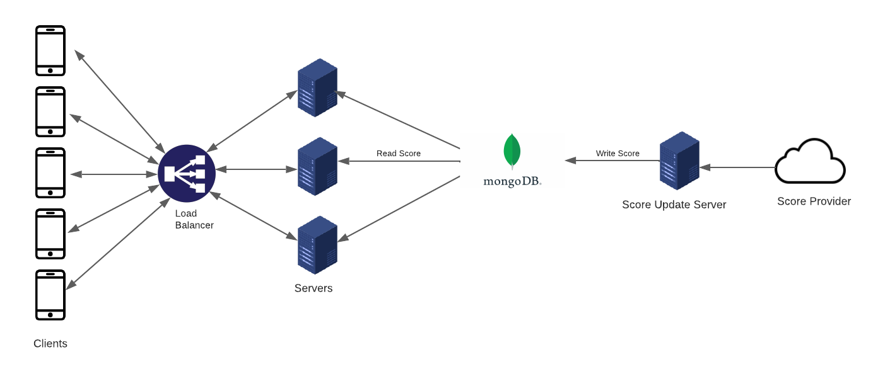

## functional requirements

- User should get list of past, ongoing and upcoming matches
- User should be able to subscribe to a game
- User should get realtime update of matches

## Non functional requirements

- Low latency
- system should be able to handle high number of traffic

## API design

1. /get-games/ongoing : GET
   output : list of ongoing games
2. /get-games/past  : GET
   output : list of past games
3. /get-games/upcoming  : GET
   output : list of upcoming games

WebSocket

3. /score/:game_id
   input : id of the game
   output : game updates

