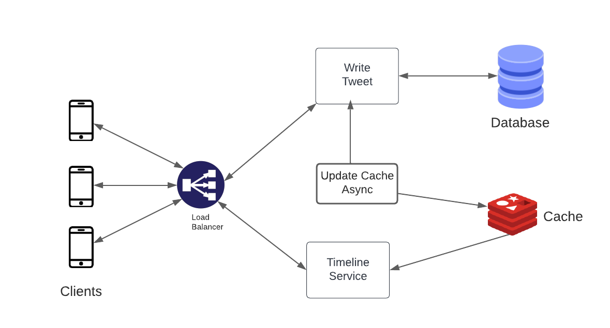

## functional requirements

1. User should be able to tweet
2. User should be able to see timeline
   1. Tweet timeline
   2. Home timeline
   3. Search timeline
3. User Should be able to see trending hashtags and topics

## Non functional requirements

1. High availability
2. should handle high number of users (30M active users)

## Traffic Estimation

1. 20M active users
2. 5000 tweets/second
3. 150 chars/tweet

# API design

1. /tweet : POST
   input : tweet
2. /timeline : get
   input : type = (tweet,home,search)

3. /trending : get
   output : get trending hashtags

## Block diagram

